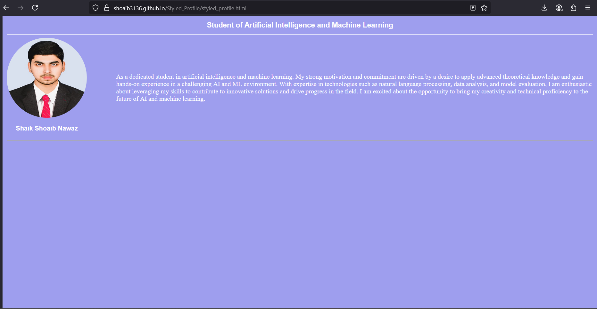
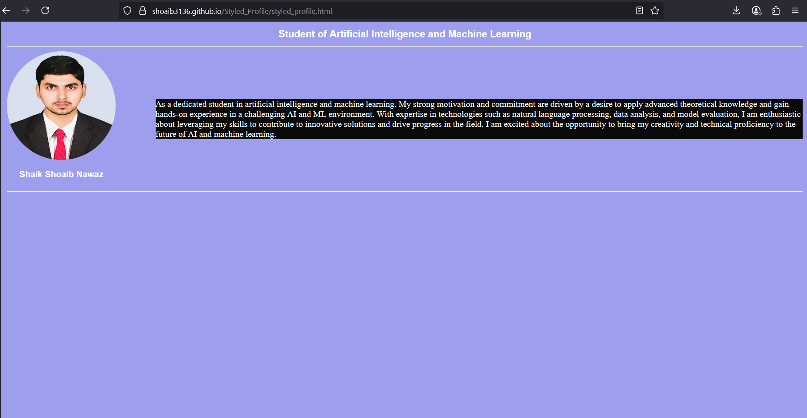

# Styled_Profile_Card
## Date: 08-07-2025

## Objective:
To practice HTML and CSS fundamentals by designing a visually appealing profile card that demonstrates the use of background color, typography, spacing, and layout alignment techniques.

## Tasks:
#### 1. Create the HTML Structure:
Use ```<!DOCTYPE html>, <html>, <head>, and <body>``` to define the structure.
Add a ```<title>``` like "My Profile Card".

#### 2. Add Content:
Include name, title (e.g., Developer, Student), and a short bio using semantic tags such as ```<h1>```, ```<h2>```, and ```<p>```.

#### 3. Add a Profile Image:
Use the `````` tag to include a profile picture with appropriate alt, width, and height attributes.

#### 4. Apply Background Color:
Use a CSS class to style the card with a background color.

#### 5. Style Typography:
Use CSS to apply different font families, sizes, and text colors for the name and bio.

#### 6. Add Spacing:
Apply margin and padding to improve spacing between elements using CSS.

#### 7. Center the Card:
Use flexbox or margin: auto to center the card vertically and horizontally on the page.

#### 8. Add Hover Effects:
Enhance interactivity with simple hover effects like border changes or background transition using CSS.

## HTML Code:
```
<!DOCTYPE html>
<html lang="en">
<head>
    <meta charset="UTF-8">
    <meta name="viewport" content="width=device-width, initial-scale=1.0">
    <title>My Profile Card</title>
    <link href="styles.css" rel="stylesheet" type="text/css">
</head>
<body>
    <section>
    <h1>Student of Artificial Intelligence and Machine Learning</h1>
    <hr>
    <div class="flex-container">
        <div>
        
        <h2 align="center">Shaik Shoaib Nawaz</h2>
        </div>
        <div>
        <p> As a dedicated student in artificial intelligence and machine learning. My strong motivation
and commitment are driven by a desire to apply advanced theoretical knowledge and gain
hands-on experience in a challenging AI and ML environment. With expertise in
technologies such as natural language processing, data analysis, and model evaluation, I am
enthusiastic about leveraging my skills to contribute to innovative solutions and drive
progress in the field. I am excited about the opportunity to bring my creativity and technical
proficiency to the future of AI and machine learning.</p>
        
        </div>
    </section>
    <hr>
</body>
</html>
```
## CSS Code:
```
body{
    background-color: rgb(158, 158, 238);
    padding: auto;
    border-left: solid rgb(158, 158, 238) ;
    border-right: solid rgb(158, 158, 238);

}
h1{
    font-family: Arial, sans-serif;
    font-size: large;
    color: white;
    text-align: center;
}
h2{
    font-family: Arial, sans-serif;
    font-size: medium;
    color: white;
   
}
hr{
    color: white
}
.flex-container{
    display: flex;
    justify-content: center;
    align-items: center;
    flex-direction: row;
    gap: 5%    ;
    color: white
}
img{
    border-radius: 50%;
}
p:hover{
    background-color: rgb(10, 10, 10);
    
}
```

## Output:



## Result:
A visually appealing profile card that demonstrates the use of background color, typography, spacing, and layout alignment techniques is designed.
